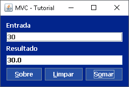
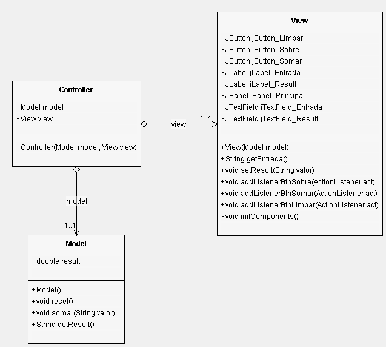

     

# MVC Java - Tutorial

Este repositório tem fins didáticos, com objetivo de demonstrar um projeto simples com a implementação do MVC na linguagem Java.

# O que é MVC?

MVC é um padrão de projeto/arquitetura de software extensivamente utilizado, criado por Trygve Reenskaug em 1979, com o propósito de dividir o projeto em três camadas independentes: **M**odel, **V**iew, **C**ontroller, com isso irá: 

* Facilitar manutenção do código
* Reduzir complexidade
* Facilitar documentação
* Facilitar reutilização de código
* Melhorar produtividade

## Model

**Model** responsável pela manipulação e processamento dos dados, incluindo lógica de tratamento e validação. 

## View

**View** é a visual por onde o usuário irá interagir através da interface gráfica da aplicação. Exibição de dados.

## Controller

**Controller** recebe as ações de entrada do usuário pelo mouse/teclado ao interagir na camada **View**, depois o **Controller** irá repassar as ações para a camada **Model** onde haverá o processado das entradas.

# Imagens

# Licença

Este projeto está sob licença [MIT](https://choosealicense.com/licenses/mit/) © 2019 Vitor de Siqueira Cotta.

Para mais informações acesse o arquivo :scroll:LICENSE.md.

# Contato

:email: E-Mail: ​[vitorsiqueira95@outlook.com](vitorsiqueira95@outlook.com) 

:clipboard: Linkedin: ​[https://www.linkedin.com/in/vitor-de-siqueira-cotta-analista-de-sistemas/](https://www.linkedin.com/in/vitor-de-siqueira-cotta-analista-de-sistemas/)

:package: GitHub:  https://github.com/VitorDeSiqueiraCotta